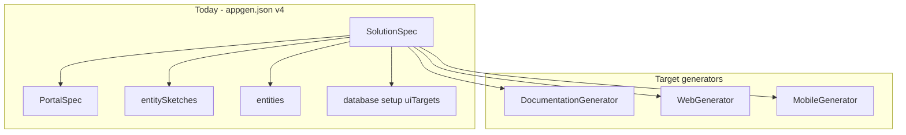
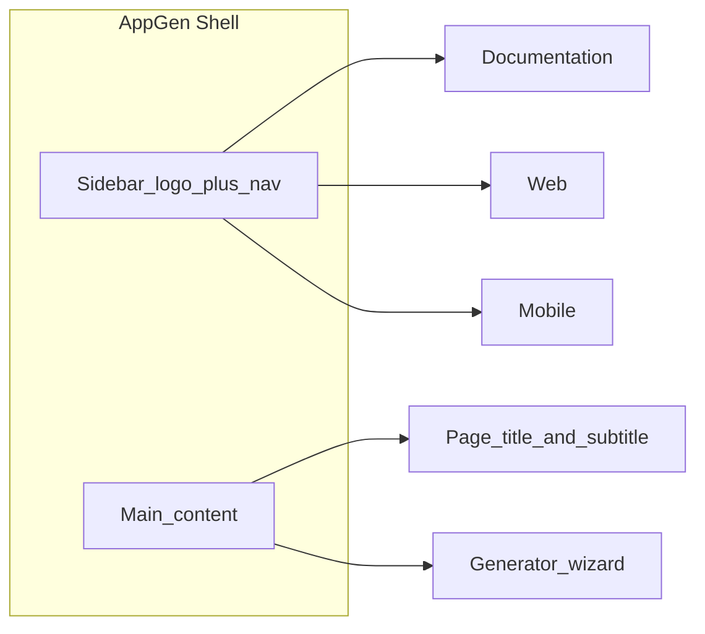
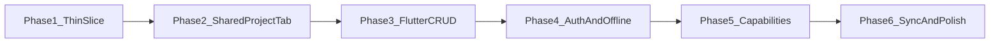

# AppGen Evolution — Feedback and Thin-Slice Roadmap

## Implementation status (2026-06-23)

Thin-slice work is **complete**. Phases 2–5 below are **done** unless noted. Use this section as the changelog for what landed in the repo.

| Area | Status | Notes |
|------|--------|-------|
| **0. Roadmap in repo** | Done | This file + README link |
| **A. Nav rename** | Done | Documentation (`/documentation`, `/portal` redirect), Web (`/web`), Mobile (`/mobile`), **Project** (`/`, `/project`) |
| **A2. UI branding** | Done | Inter font, slate sidebar, CSS tokens, logo/favicon, `PageHeader`, stacked-layers icon. **AppGen** is the product name; **Application factory** is the tagline under the logo (not a replacement title) |
| **B. Schema v5–v8** | Done | `ApplicationTargets`, `GenerationMetadata`, `SpecNormalizer`, v3–v7 load compat; **v8** adds `targets.mobile.capabilities` |
| **C. Generator plugins** | Done | `IApplicationGenerator`; `DocumentationApplicationGenerator`, `MobileApplicationGenerator` |
| **D. Flutter CRUD** | Done | `FlutterGenerator` + Scriban templates — list, detail, create/edit form, delete per entity; `go_router` nested routes |
| **E. Mobile tab UI** | Done | Entity picker, package name, API URL, Generate / Load project |
| **F. CLI** | Done | `appgen mobile create`, `spec export`, `spec import` |
| **G. Tests** | Done | Portal, mobile CRUD, capabilities, spec workbook, v5+ round-trip, generation output paths |
| **H. Shared entity workflow** | Done | `WizardStateService` (Web ↔ Mobile ↔ Project session state), **Save manifest**, **Load draft** |
| **I. Project tab (Phase 2)** | Done | `Project.razor` hub, `ProjectWorkspace` shared entity editor, layer toggles, **Generate all**, per-layer output folders (`{AppName} Doc/Web/Mobile`) |
| **J. Project metadata + READMEs + tab help** | Done | Schema v6 `project` (tagline, description), per-layer READMEs, **?** help drawer |
| **K. Spec workbook** | Done | Excel export/import (Application, Sections, Entities, Properties, Data_* → seed SQL); Project tab panel; see [`docs/plans/appgen-spec-workbook.md`](plans/appgen-spec-workbook.md) |
| **L. Documentation session state** | Done | `PortalUiDraft` — section edits persist when switching Project ↔ Documentation; hub manifest load after workbook import |
| **M. Mobile capabilities** | Done | Schema v8 catalog, Flutter services, platform permission patcher; see [`docs/plans/mobile-capabilities-system.md`](plans/mobile-capabilities-system.md) |
| **N. Mobile publish script** | Done | Generated `scripts/publish-mobile.ps1` → `dist/` + `mobile-version.json`; `targets.mobile.publish`; see [`docs/plans/mobile-publish-script.md`](plans/mobile-publish-script.md) |

### Shared entity workflow (Phase 2)

Web, Mobile, and **Project** tabs share entity definitions via `WizardStateService`:

1. Define entities on **Project** (or Web) → enable Documentation / Web / Mobile layers → **Generate all**, or
2. Click **Save manifest** → writes `appgen.json` to the hub folder (`output/{AppName}/`), or
3. **Save draft** / **Load draft** (JSON file) — available on Project, Web, and Mobile

**Layer output folders** (avoids overwrite clashes when generating multiple targets):

| Layer | Folder |
|-------|--------|
| Hub (manifest) | `output/{AppName}/` |
| Documentation | `output/{AppName} Doc/` |
| Web | `output/{AppName} Web/` |
| Mobile | `output/{AppName} Mobile/` |

**Not yet done** (see long-term phases below): per-target incremental sync, OpenAPI client gen, AppGen UI publish button, in-app update checker in generic Flutter templates.

**Phase 4 (done):** JWT auth scaffold (Web toggle + mobile login), optional SQLite offline cache (independent Mobile toggle), generated API/MVC xUnit integration tests with EF InMemory.

**Phase 5 (done):** Mobile **Capabilities** system — schema v8, capability catalog, Flutter services/packages/permissions generation.

**Phase 6 (partial):** Spec workbook (done), mobile publish script (done), documentation tab persistence (done).

---

## Overall assessment

Your vision is **directionally right** and **already partially built**. The portal-to-API bridge you shipped (`appgen.json` v4, `entitySketches`, `ProjectPromoter`) is the seed of the shared Application Definition. The proposal’s main job now is to **formalize that model** and **add generator plugins** — not restart from scratch.

What you have today in [`SolutionSpec`](src\AppGen.Core\Models\SolutionSpec.cs):



---

## Suggestions on your proposal

### 1. Naming: Documentation / Web / Mobile (your choice)

Good pick. Short, clear, and matches the “application factory” story.

| Tab | Generates | Note |
|-----|-----------|------|
| **Documentation** | `portal/` static site | Rename from Portal; keep preset system |
| **Web** | `src/` .NET solution | Rename from API; subtitle should say “API + layers + optional MVC” |
| **Mobile** | `mobile/flutter/` (new) | New; framework selector comes later |

Avoid calling the middle tab just “API” internally going forward — it undersells MVC and future SignalR/Identity additions.

### 2. Don’t wait for perfection before Mobile — but **do** formalize the shared model first

Your Flutter section assumes relationships, validation, auth, and known endpoints. AppGen today has:

- Entities + FK properties (partial relationships)
- Swagger on generated APIs
- **Deferred**: full relationships, validation, pagination ([README](README.md))

**Recommendation:** Mobile v0 should generate from **`EntitySpec` + convention-based routes** (same pattern as MVC/API templates), not full OpenAPI parsing yet. Add OpenAPI-driven Dart clients in phase 2 once the contract is stable.

### 3. UI structure: shared definition + layer tabs

Your long-term “choose layers then define entities” workflow is right, but **entities should not live inside each tab**. Proposed UX:

```
Project (shared)
  - App name, output folder
  - Entities + properties (single editor)
  - Layer toggles: Documentation | Web | Mobile

Documentation tab  → portal-only options (sections, theme, password)
Web tab            → database, MVC, connection strings (today’s Index.razor)
Mobile tab         → package name, Riverpod, API base URL
```

This prevents the drift you already felt between portal sketches and API entities.

### 4. Rename `SolutionSpec` gradually, not abruptly

Avoid a big-bang rename that breaks existing `appgen.json` files. Evolve schema **v5**:

```json
{
  "schemaVersion": 5,
  "applicationName": "DeltaCore",
  "targets": {
    "documentation": { "enabled": true, "preset": "engineering-portal", ... },
    "web": { "enabled": true, "database": "PostgreSql", "uiTargets": ["MvcWeb"], ... },
    "mobile": { "enabled": false, "framework": "flutter", ... }
  },
  "entities": [...],
  "entitySketches": [...]
}
```

Keep v4 deserializer mapping `portal` → `targets.documentation` and top-level web fields → `targets.web`.

### 5. Generator plugin architecture (small interface, big payoff)

Extract a common pattern from existing [`PortalGenerator`](src\AppGen.Engine\PortalGenerator.cs), [`SolutionGenerator`](src\AppGen.Engine\SolutionGenerator.cs), and future `FlutterGenerator`:

```csharp
interface IApplicationGenerator
{
    string TargetId { get; }           // "documentation" | "web" | "mobile"
    Task<GenerationResult> GenerateAsync(ApplicationDefinition spec, string projectDir, GeneratorOptions options, CancellationToken ct);
}
```

Each generator:
- Reads the **same** `entities` list
- Writes only its output subtree (`portal/`, `src/`, `mobile/flutter/`)
- Never deletes sibling outputs unless `--force` scoped to that target

This enables your future “Update Mobile only” sync story.

### 6. Flutter scope — phase realistically

| Phase | Flutter output | Skip for now |
|-------|----------------|--------------|
| **Initial mobile (done)** | `pubspec.yaml`, folder structure, entity model, Dio service, Riverpod provider, list screen, `main.dart` + routes | — |
| **v1 (done — Phase 3)** | Full CRUD screens per entity, `go_router` routes, theme scaffold | Isar, biometrics |
| **v2** | JWT login flow, secure storage, interceptors | MAUI, React Native |

Default stack for the mobile client (sensible, popular, matches your proposal):

- **Riverpod** + **go_router** + **dio**
- Material 3 theme stub with brand colors from portal theme (optional link)

### 7. API integration strategy

**Initial mobile:** Template-generated Dart from entity name + property types, mirroring API controller routes:

```
GET    /api/v1/{Entity}
GET    /api/v1/{Entity}/{id}
POST   /api/v1/{Entity}
PUT    /api/v1/{Entity}/{id}
DELETE /api/v1/{Entity}/{id}
```

**Later:** Emit `openapi.json` path in manifest; optional `dart run build_runner` OpenAPI client gen.

### 8. Sync / “Update Mobile” — design now, build later

Store per-target generation metadata in manifest:

```json
"generation": {
  "mobile": {
    "lastGenerated": "2026-06-25",
    "entities": ["Product"]
  }
}
```

Enables future incremental entity add without full regen. Do **not** implement sync in the thin slice — just leave the manifest hook.

### 9. What NOT to do yet

- Multiple mobile frameworks in one release
- Full relationship graph UI
- Blazor/React/Angular generators
- IaC / GitHub Actions (unless Documentation deploy workflow only)
- Replacing separate tabs with one mega-wizard (until shared entity editor exists)

---

## Thin-slice implementation plan (your chosen next phase)

### 0. Roadmap document in source control (do first)

Keep the evolution plan in the **AppGen repo** so it survives outside Cursor and is versioned with the code.

| Item | Detail |
|------|--------|
| **Source** | This plan file (`.cursor/plans/appgen_evolution_roadmap_7a307fde.plan.md`) |
| **Target path** | [`AppGen/docs/EVOLUTION_ROADMAP.md`](docs\EVOLUTION_ROADMAP.md) |
| **Format** | Markdown body only — omit Cursor frontmatter (`todos`, `isProject`, etc.) |
| **README link** | Add a short "Evolution roadmap" section in [`AppGen/README.md`](README.md) pointing to `docs/EVOLUTION_ROADMAP.md` |
| **Git** | Commit to `AppGen` on `dev-main` (or your working branch) as a standalone docs commit before or alongside phase 1 work |

**Maintenance rule:** When the roadmap changes, update `docs/EVOLUTION_ROADMAP.md` in the repo — treat it as the canonical copy; the Cursor plan file is optional working notes.

Optional later: add `docs/ARCHITECTURE.md` for generator plugin design once `IApplicationGenerator` lands.

### A. Navigation rename ✅

Update [`NavMenu.razor`](src/AppGen.UI/Shared/NavMenu.razor):

- `Portal` → **Documentation** (routes `/documentation`; `/portal` redirects for bookmarks)
- `API` → **Web** (routes `/` and `/web`)
- **Mobile** nav item → `/mobile`

Update page titles/subtitles in [`Portal.razor`](src/AppGen.UI/Pages/Portal.razor) and [`Index.razor`](src/AppGen.UI/Pages/Index.razor).

### A2. UI branding and professional styling ✅

Today the UI is still the **default Blazor Server template**: generic purple gradient sidebar ([`MainLayout.razor.css`](src\AppGen.UI\Shared\MainLayout.razor.css)), stock Bootstrap blues, Open Iconic glyphs, no favicon. For a custom internal tool that will grow into an "Application Factory", a cohesive brand pays off — especially when demoing to others.

**Design direction:** clean developer-tool aesthetic — not flashy, not corporate-bland. Think VS Code / Linear / Vercel dashboard: dark sidebar, light content area, one strong accent, generous whitespace.

**Proposed AppGen palette** (distinct from DeltaCore portal, but similarly professional):

| Token | Value | Use |
|-------|-------|-----|
| `--ag-sidebar` | `#0f172a` | Sidebar background (slate) |
| `--ag-sidebar-accent` | `#1e293b` | Hover / active nav |
| `--ag-accent` | `#3b82f6` | Primary buttons, active links |
| `--ag-accent-muted` | `#60a5fa` | Focus rings, subtle highlights |
| `--ag-surface` | `#ffffff` | Main content |
| `--ag-bg` | `#f8fafc` | Page background |
| `--ag-border` | `#e2e8f0` | Panels, inputs |
| `--ag-text` | `#0f172a` | Headings |
| `--ag-text-muted` | `#64748b` | Subtitles, hints |

**Typography:** switch from Helvetica to **Inter** (already used in generated documentation portals) via Google Fonts in [`_Layout.cshtml`](src\AppGen.UI\Pages\_Layout.cshtml).

**Custom icon concept** — "stacked application layers" (matches Application Factory story):

```
┌─────────┐
│  Doc    │  ← top layer (documentation)
├─────────┤
│  Web    │  ← middle layer (backend/MVC)
├─────────┤
│ Mobile  │  ← bottom layer (Flutter)
└─────────┘
```

Simplified as a compact SVG mark: three offset rounded rectangles in accent blue, or a single hexagon with three horizontal bars. Works at 16px (favicon) and 32px (sidebar).

**Assets to add** under `wwwroot/`:

| File | Purpose |
|------|---------|
| `assets/logo.svg` | Sidebar brand mark + wordmark "AppGen" |
| `assets/logo-icon.svg` | Icon only (collapsed sidebar future) |
| `favicon.svg` | Modern browsers |
| `favicon.ico` | Fallback |

**Layout changes:**



- [`NavMenu.razor`](src/AppGen.UI/Shared/NavMenu.razor) — logo + **AppGen** wordmark with **Application factory** tagline beneath; nav items with inline SVG icons
- [`MainLayout.razor`](src\AppGen.UI\Shared\MainLayout.razor) — optional slim top bar on main area showing current generator tab
- New shared component `PageHeader.razor` — title, subtitle, optional status badge (e.g. "Portal phase" when loaded from manifest)
- [`site.css`](src\AppGen.UI\wwwroot\css\site.css) — CSS variables, refined `.panel` (subtle shadow, 8px radius), button hierarchy, improved status panels
- Remove purple gradient from [`MainLayout.razor.css`](src\AppGen.UI\Shared\MainLayout.razor.css) and [`NavMenu.razor.css`](src\AppGen.UI\Shared\NavMenu.razor.css)

**What to avoid:**

- Heavy custom CSS framework — stay on Bootstrap grid/utilities, override tokens only
- Dark mode for v1 (defer; design tokens make it easy later)
- Animated backgrounds or gradients — keep it calm and tool-like

**Scope:** branding ships in the same PR as nav rename so users see Documentation / Web / Mobile in a polished shell from day one. No functional dependency on schema v5 or Flutter.

### B. Shared Application Definition (schema v5 prep) ✅

In [`AppGen.Core`](src\AppGen.Core):

- Add `ApplicationTargets` with `DocumentationTarget`, `WebTarget`, `MobileTarget`
- Add `MobileTargetSpec` (framework, packageName, apiBaseUrl, stateManagement, enabled)
- Extend [`SpecLoader`](src\AppGen.Engine\SpecLoader.cs) for v4 ↔ v5 compat
- Refactor [`ProjectManifestMapper`](src\AppGen.UI\Services\ProjectManifestMapper.cs) to write unified targets

**UI change shipped:** `WizardStateService` + **Save manifest** on Web and Mobile; Mobile shows shared entities from Web session. Full shared entity editor component deferred to Phase 2.

### C. Flutter generator ✅

New in [`AppGen.Engine`](src\AppGen.Engine):

- `FlutterGenerator` implementing `IApplicationGenerator`
- Scriban templates under `AppGen.Templates/Templates/Mobile/flutter/`

**Output** (`mobile/flutter/`):

```
pubspec.yaml
lib/main.dart
lib/core/config/api_config.dart
lib/core/network/api_client.dart
lib/features/{entity}/models/{entity}_model.dart
lib/features/{entity}/services/{entity}_service.dart
lib/features/{entity}/providers/{entity}_provider.dart
lib/features/{entity}/screens/{entity}_list_screen.dart
lib/features/{entity}/screens/{entity}_detail_screen.dart
lib/features/{entity}/screens/{entity}_form_screen.dart
lib/app/router.dart
lib/app/theme.dart
```

Generate for **all entities with `IncludeInUi`** (or user-selected entity on Mobile tab).

**Phase 3 CRUD** (current): per entity — list with pull-to-refresh and FAB, detail with delete, create/edit form, Dio `getById` / `create` / `update` / `delete`, `go_router` routes (`/{entity}`, `/{entity}/new`, `/{entity}/:id`, `/{entity}/:id/edit`).

### D. Mobile tab UI ✅

New [`Pages/Mobile.razor`](src\AppGen.UI\Pages\Mobile.razor):

- Package name (default: `com.{appname}.app`)
- API base URL (default: `https://localhost:5001`)
- State management: Riverpod (fixed for initial mobile)
- Entity picker (dropdown from loaded manifest entities)
- **Save manifest** / **Load draft** (shared with Web workflow)
- **Generate Mobile** button
- **Load project** (reads `appgen.json` from output folder)

### E. CLI ✅

```powershell
appgen mobile create --project output/MyApp [--entity Product] [--force]
```

### F. Tests ✅

- Flutter generate produces expected tree for one entity
- v4/v3 manifest still loads (normalized to v5 in memory)
- v5 manifest round-trips targets
- Existing portal/promote tests pass (12 total)

### G. Shared entity workflow ✅

New in [`AppGen.UI`](src/AppGen.UI):

- [`WizardStateService`](src/AppGen.UI/Services/WizardStateService.cs) — scoped per-session state; Web pushes on navigate away, Mobile subscribes on load
- [`ManifestSaveService`](src/AppGen.UI/Services/ManifestSaveService.cs) — writes `appgen.json` without generating `src/`
- Web **Save manifest** button; Mobile **Load draft**, **Save manifest**, shared-entity status banner

---

## Suggested long-term phases (after thin slice)



| Phase | Focus |
|-------|--------|
| 1 | ~~Rename nav, UI branding, targets model, Flutter mobile~~ **Done** |
| 2 | ~~Dedicated **Project** tab with single entity editor; layer checkboxes; one **Generate All**~~ **Done** |
| 3 | ~~Full Flutter CRUD + navigation per entity~~ **Done** |
| 4 | ~~JWT auth scaffold + optional SQLite cache~~ **Done** |
| 5 | ~~Mobile capabilities catalog + Flutter emission~~ **Done** |
| 6 | Spec workbook, publish script, doc tab persistence — **partial**; remaining: incremental sync, OpenAPI client, MAUI, CI/CD templates |

---

## Bottom line

Your proposal is **coherent and achievable** because AppGen already generates multiple layers from one manifest. The highest-leverage moves are:

1. **One entity model, many generators** (formalize v5 targets)
2. **Generator plugin interface** (keeps Documentation/Web/Mobile independent)
3. **Flutter mobile client with conventions, not OpenAPI** (ship fast, harden later)
4. **Rename UI now** to match the story (Documentation / Web / Mobile)
5. **Rebrand the shell** so AppGen feels like a product, not a Blazor starter template

The thin slice gives you a demoable “application factory” narrative without committing to auth, offline, or multi-framework mobile yet.
