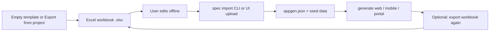

# Plan: AppGen Spec Workbook — Template, Excel Round-Trip & Import

> **Status:** Implemented (Phases 1–3; UI + CLI)  
> **Last updated:** 2026-06-23  
> **Scope:** Generic AppGen capability — any app, not Huntress Cookbook-specific.

## 1. Goal

Let developers (or non-developers) describe an app in a **structured template**, export it as an **Excel workbook** for easy editing, then **upload/import** it back into AppGen to:

1. Populate **`appgen.json`** fields (application info, targets, entities, property types, portal sections, etc.)
2. Optionally populate **seed/sample data** per entity (e.g. `User` rows with `Username`, `Age`)
3. Trigger **code generation** with real structure and data instead of hand-typing in the Blazor wizard

**Closed loop:**



This is **spec + seed import**, not “regenerate custom screens from content.” AppGen still scaffolds list/detail/form from entities; the workbook defines **what** those entities are and **sample rows** to load.

---

## 2. What exists today

| Mechanism | Status |
|-----------|--------|
| Blazor **Project** tab — `SpecWorkbookPanel` | Download template, export project, import workbook, validation report |
| CLI `spec export` / `spec import` | [`AppGen.CLI/Program.cs`](../../src/AppGen.CLI/Program.cs) |
| Workbook engine | `SpecWorkbookReader`, `SpecWorkbookWriter`, `SpecDocumentValidator`, `SolutionSpecMerger`, `SpecImportService`, `ImportedSeedScriptBuilder` |
| Template xlsx | `docs/templates/appgen-spec-template.xlsx` |
| User guide | [`docs/authoring/appgen-spec-workbook-guide.md`](../authoring/appgen-spec-workbook-guide.md) |
| Tests | [`SpecWorkbookTests.cs`](../../src/AppGen.Tests/SpecWorkbookTests.cs) — round-trip, sections import, seed SQL, validation |

### Import behaviour (implemented)

- **Application** sheet → `appgen.json` application info, targets, project metadata
- **Sections** sheet → `portal.sections` + `portal.nav` (documentation layer)
- **Entities** + **Properties** → `entities[]`
- **Data_\<Entity\>** sheets → `scripts/{provider}/002-seed-data.sql`
- Import resolves hub folder from workbook **ApplicationName** (not only the UI app name field)
- After import, UI loads manifest from the **hub** `appgen.json` and notifies `WizardStateService`

### Documentation tab persistence (2026-06-23)

Section edits on the Documentation tab are kept in `PortalUiDraft` via `WizardStateService` while navigating Project ↔ Documentation. Manifest load and workbook import refresh the draft from hub data.

### Remaining gaps

| Gap | Notes |
|-----|-------|
| Portal **block content** in workbook | Sections metadata only; rich blocks still edited in Documentation UI or `portal/data/*.json` |
| YAML/JSON interchange | Deferred (v2) |
| Workbook field for `targets.mobile.publish` | Edit `appgen.json` or use generated `publish-mobile.ps1` params |

---

## 3. Workbook structure (proposed sheets)

One **`.xlsx`** file per app project (e.g. `MyApp-appgen-spec.xlsx`).

### Sheet: `Application`

| Field | Example | Maps to |
|-------|---------|---------|
| ApplicationName | InventoryApp | `solutionSpec.ApplicationName` |
| RootNamespace | InventoryApp | `solutionSpec.RootNamespace` |
| Tagline | Track stock offline | `project.Tagline` |
| Description | ... | `project.Description` |
| Database | SqlServer / PostgreSql / Oracle | `solutionSpec.Database` |
| EnableDocumentation | true | `targets.documentation.enabled` |
| EnableWeb | true | `targets.web.enabled` |
| EnableMobile | true | `targets.mobile.enabled` |
| EnableWebAuth | false | `targets.web.auth.enabled` |
| EnableMobileOffline | true | `targets.mobile.offline.enabled` |
| MobileThemePreset | cookbook | `targets.mobile.theme.preset` |
| MobileApiBaseUrl | http://localhost:5000 | `targets.mobile.apiBaseUrl` |

### Sheet: `Sections` (documentation / portal)

For portal-first or documentation layer — one row per section:

| Field | Example |
|-------|---------|
| SectionId | vision |
| Title | Product Vision |
| Status | active / planned |
| Summary | Short blurb |
| Tags | strategy, roadmap |
| NavNum | 1 |
| NavLabel | Vision |

Maps to `PortalSpec.Sections[]` and `PortalSpec.Nav[]`.

*Optional v2:* blocks/content columns or separate `SectionBlocks` sheet.

### Sheet: `Entities`

| Field | Example |
|-------|---------|
| EntityName | User |
| TableName | Users |
| IncludeInUi | true |
| IncludeAuditColumns | true |

### Sheet: `Properties`

| Field | Example |
|-------|---------|
| EntityName | User |
| PropertyName | Username |
| ClrType | string |
| IsKey | false |
| IsNullable | false |
| ForeignKeyEntity | |
| ColumnName | (optional) |

One row per property. `EntityName` links to `Entities` sheet.

### Sheet: `Data_<EntityName>` (one sheet per entity)

Dynamic columns = property names for that entity. Header row required.

**Example `Data_User`:**

| User_Id | Username | Age | Email |
|---------|----------|-----|-------|
| 1 | jane | 32 | jane@example.com |
| 2 | bob | 28 | bob@example.com |

- Column names match `PropertySpec.Name` (PascalCase or documented convention).
- Import validates types (`Age` → int).
- Maps to **`002-seed-data.sql`** (and API dev seed if applicable) instead of placeholder rows.

**Convention:** Sheet name prefix `Data_` distinguishes data sheets from spec sheets.

---

## 4. Authoring formats (input options)

| Format | Role |
|--------|------|
| **Excel `.xlsx`** | Primary human edit surface (round-trip) |
| **CSV zip** | Alternative upload (one CSV per sheet) for simpler tooling |
| **YAML `appgen-spec.yaml`** | Developer-friendly source; CLI converts YAML ↔ xlsx |
| **JSON `appgen-spec.json`** | Machine interchange; mirrors workbook sections |

**Recommended v1:** Excel only + export template. YAML/JSON as v2 for git-friendly repos.

### Example YAML (optional future — mirrors workbook)

```yaml
application:
  name: InventoryApp
  database: SqlServer
  targets:
    web: true
    mobile: true

sections:
  - id: vision
    title: Product Vision
    summary: ...

entities:
  - name: User
    properties:
      - name: Username
        type: string
      - name: Age
        type: int
    data:
      - { Username: jane, Age: 32 }
      - { Username: bob, Age: 28 }
```

---

## 5. Import pipeline

### CLI

```powershell
# Export empty template or from existing project
dotnet run --project src/AppGen.CLI -- spec export `
  --project output/MyApp `
  --output MyApp-appgen-spec.xlsx

# Import workbook → update appgen.json + seed SQL
dotnet run --project src/AppGen.CLI -- spec import `
  --project output/MyApp `
  --input MyApp-appgen-spec.xlsx `
  [--merge]   # merge with existing manifest vs replace entities
  [--validate-only]
```

### Blazor UI

**Project** or new **Spec** tab:

- Download template `.xlsx`
- Export current project to `.xlsx`
- Upload `.xlsx` → validation report → **Apply to manifest**
- Button: **Generate all** (existing flow)

### Implementation classes (mirror `PortalSpecImporter`)

| Class | Responsibility |
|-------|----------------|
| `SpecWorkbookReader` | Parse xlsx sheets → `AppGenSpecDocument` DTO |
| `SpecWorkbookWriter` | `SolutionSpec` + seed rows → xlsx |
| `SpecDocumentValidator` | Unknown types, duplicate keys, FK integrity, missing required fields |
| `SolutionSpecMerger` | Merge `AppGenSpecDocument` into `SolutionSpec` |
| `SeedDataGenerator` | `Data_*` sheets → `002-seed-data.sql` per database provider |

**Library:** [ClosedXML](https://github.com/ClosedXML/ClosedXML) or [DocumentFormat.OpenXml](https://github.com/OfficeDev/Open-Xml-SDK) in `AppGen.Engine`.

---

## 6. What import populates

| Workbook section | Output |
|------------------|--------|
| Application | `appgen.json` top-level + `targets` + `project` |
| Sections | `portal` section of manifest (if documentation enabled) |
| Entities + Properties | `entities[]` in manifest |
| Data_* sheets | `scripts/sqlserver/002-seed-data.sql` (and pg/oracle variants) |
| (future) Section body text | `portal/data/{section}.json` files |

After import, user runs existing **`create` / `promote` / `mobile create`** or UI **Generate** — no change to generator contracts.

---

## 7. Validation rules

- Every `Properties.EntityName` must exist on `Entities`
- Exactly one `IsKey = true` per entity (or auto-suggest `{Entity}_Id` long key if omitted)
- `ForeignKeyEntity` must reference a defined entity
- `ClrType` must be in allowed set
- `Data_*` columns must match property names; extra columns = warning
- Type coercion errors (e.g. `Age` = `"abc"`) = blocking error with row number
- Duplicate primary keys in data sheets = error

---

## 8. Phased delivery

### Phase 1 — Spec only — **Done**

- Export/import `Application`, `Entities`, `Properties` sheets
- CLI `spec export` / `spec import`
- UI upload + validation panel on Project tab
- Shipped template under `docs/templates/`

### Phase 2 — Sections sheet — **Done**

- Portal `Sections` + `Nav` from workbook
- Rich block content remains in Documentation UI / portal JSON files

### Phase 3 — Data sheets → seed SQL — **Done**

- `Data_<Entity>` → `002-seed-data.sql` per database provider
- Validation cites sheet name + row number

### Phase 4 — Round-trip polish — **Done for v1**

- [x] Export from existing `appgen.json` preserves wizard/manifest data
- [x] `--merge` strategy on CLI import

### Future work

- [ ] YAML/JSON workbook interchange (optional)

---

## 9. Relationship to other plans

| Plan | Relationship |
|------|----------------|
| Huntress `content-authoring-pipeline.md` | **Domain-specific** recipe content for HuntressCookbook-Mobile — not this workbook |
| [`mobile-publish-script.md`](./mobile-publish-script.md) | Generated `publish-mobile.ps1` per mobile app; optional `publish.baseUrl` in manifest |
| `portal import` | Imports portal **content** JSON; workbook imports **structure** + seed **rows** |
| `WizardDraft` | Session save; workbook is the portable, Excel-friendly equivalent |

For Huntress: keep recipe YAML/JSON pipeline. For **new AppGen apps** (inventory, CRM, etc.): use **Spec Workbook**.

---

## 10. Affected files (AppGen)

| File | Status |
|------|--------|
| `AppGen.Engine/SpecWorkbook/*` | Done — reader, writer, validator, merger, import/export services |
| `AppGen.Engine/ImportedSeedScriptBuilder.cs` | Done |
| `AppGen.CLI/Program.cs` | Done — `spec export`, `spec import` |
| `AppGen.UI/Components/SpecWorkbookPanel.razor` | Done — Project tab upload/download |
| `AppGen.UI/Pages/Portal.razor` + `WizardStateService` | Done — hub manifest load, `PortalUiDraft` persistence |
| `AppGen.Tests/SpecWorkbookTests.cs` | Done |
| `docs/templates/appgen-spec-template.xlsx` | Done |
| `docs/authoring/appgen-spec-workbook-guide.md` | Done |

---

## 11. Resolved decisions

1. **Sheet naming:** `Data_<EntityName>` prefix (e.g. `Data_User`)
2. **Key generation:** import can auto-add `{Entity}_Id` when missing
3. **Portal blocks:** not in workbook v1 — metadata in **Sections** sheet only
4. **Merge strategy:** CLI `--merge`; default import replaces entities listed in workbook

## 12. Success criteria — met

- [x] Download template, fill entities + data rows, import, generate, see real seed data in API/SQL
- [x] Export → edit property type → re-import → regen updates models without re-entering wizard
- [x] Validation errors cite **sheet name + row number**
- [x] Workbook **Sections** populate Documentation tab section list after import
