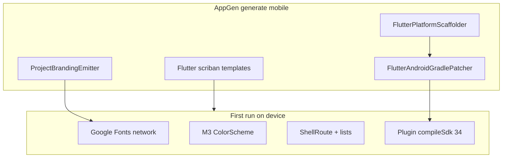

# Mobile Flutter scaffold issues

> Template/engine fixes from **Active_Huntress Mobile** (`output/Active_Huntress Mobile`). Golden manual fixes live in that output folder until Scriban templates catch up.

Discovered while shipping Active_Huntress Mobile and hardening AppGen. **Already fixed in AppGen** vs **still open in templates / docs** are called out separately.



---

## Already addressed in AppGen (keep; verify on regen)

| Issue | Symptom | Fix location |
|--------|---------|----------------|
| App `compileSdk` too low | `file_picker:checkDebugAarMetadata` requires API 36 | [`FlutterAndroidGradlePatcher`](src\AppGen.Engine\FlutterAndroidGradlePatcher.cs) — app `build.gradle.kts` `maxOf(..., 36)` |
| Plugin modules still on SDK 34 | Same error on `:file_picker` not `:app` | Same patcher — root [`android/build.gradle.kts`](output\Active_Huntress Mobile\android\build.gradle.kts) `LibraryExtension.compileSdk = 36` |
| Offline mode confusion | “Offline cache” still used Dio/API | `MobileOfflineModes`, UI radios, standalone local templates ([`FlutterGenerator.cs`](src\AppGen.Engine\FlutterGenerator.cs)) |
| README troubleshooting | Repeat compileSdk surprise | [`ReadmeGenerator.cs`](src\AppGen.Engine\ReadmeGenerator.cs) |

**Regression tests:** [`FlutterAndroidGradlePatcherTests.cs`](src\AppGen.Tests\FlutterAndroidGradlePatcherTests.cs), standalone/offline generation in [`AuthAndOfflineTests.cs`](src\AppGen.Tests\AuthAndOfflineTests.cs).

---

## Open — Flutter templates (apply to all new scaffolds)

### 1. Google Fonts → ANR / debugger pause (high)

**Symptom:** App UI appears, then “isn’t responding”; log: `google_fonts was unable to load font PlayfairDisplay-Bold`.

**Cause:** Templates call `GoogleFonts.*` everywhere ([`theme.dart.scriban`](src\AppGen.Templates\Templates\Mobile\flutter\theme.dart.scriban), [`app_drawer.dart.scriban`](src\AppGen.Templates\Templates\Mobile\flutter\app_drawer.dart.scriban), [`app_page_header.dart.scriban`](src\AppGen.Templates\Templates\Mobile\flutter\app_page_header.dart.scriban)). On emulator/offline or with `allowRuntimeFetching = false`, runtime fetch fails and can stall the UI thread.

**Fix options (pick one strategy in templates):**

- **A (recommended for standalone/offline):** Platform `TextTheme` + `Theme.of(context).textTheme` in drawer/header; no runtime font fetch. Mirror what Active_Huntress now uses in [`theme.dart`](output\Active_Huntress Mobile\lib\app\theme.dart) / [`app_drawer.dart`](output\Active_Huntress Mobile\lib\app\app_drawer.dart).
- **B (branded online apps):** Bundle fonts via `google_fonts` asset workflow + document in mobile README; optional `main.dart.scriban` preload with clear loading UI.
- **C:** Theme preset flag: `offlineSafeFonts: true` for standalone local mode only.

**Do not** mix `allowRuntimeFetching = false` with template `GoogleFonts.playfairDisplay` in drawer (preset-specific fonts).

---

### 2. Material 3 incomplete `ColorScheme` (medium)

**Symptom:** Dark window + little or no visible UI (“black screen”) even when router works.

**Cause:** [`theme.dart.scriban`](src\AppGen.Templates\Templates\Mobile\flutter\theme.dart.scriban) uses partial `ColorScheme(...)` constructor.

**Fix:** Use `ColorScheme.fromSeed` (or `ThemeData.dark().colorScheme.copyWith(...)`) like Active_Huntress; cache `final appTheme = buildAppTheme()` in template [`main.dart.scriban`](src\AppGen.Templates\Templates\Mobile\flutter\main.dart.scriban).

---

### 3. `MaterialApp.router` dark-only apps (medium)

**Symptom:** Wrong brightness slot / hard-to-see chrome on dark system UI.

**Cause:** [`main.dart.scriban`](src\AppGen.Templates\Templates\Mobile\flutter\main.dart.scriban) sets only `theme: buildAppTheme()` with dark colors.

**Fix:** When `theme_is_dark`, emit `darkTheme` + `themeMode: ThemeMode.dark` (and optionally light fallback).

---

### 4. ShellRoute / `AppShell` routing context (low–medium)

**Cause:** [`app_shell.dart.scriban`](src\AppGen.Templates\Templates\Mobile\flutter\app_shell.dart.scriban) uses `GoRouterState.of(context)`; [`router.dart.scriban`](src\AppGen.Templates\Templates\Mobile\flutter\router.dart.scriban) passes only `child`.

**Fix:** Pass `location: state.uri.path` into `AppShell` (Active_Huntress pattern in [`router.dart`](output\Active_Huntress Mobile\lib\app\router.dart)).

---

### 5. List screens: `Column` + `Expanded` without `Scaffold` (medium)

**Symptom:** Layout exceptions or empty body depending on parent constraints.

**Cause:** [`entity_list_screen.dart.scriban`](src\AppGen.Templates\Templates\Mobile\flutter\entity_list_screen.dart.scriban) (same for form/detail inside shell).

**Fix:** Wrap body in `Scaffold(backgroundColor: ...)` or document that shell must always provide bounded height; prefer `Scaffold` in entity screens for consistency with [`home_screen.dart`](output\Active_Huntress Mobile\lib\features\home\home_screen.dart) fix.

---

### 6. Custom hub icon / large PNG in drawer (low)

**Symptom:** Jank or ANR when wide layout shows drawer with full-res hub icon.

**Cause:** [`ProjectBrandingEmitter`](src\AppGen.Engine\ProjectBrandingEmitter.cs) copies source PNG; drawer may decode 1024² on UI thread.

**Fix:** Emit a small `assets/branding/icon_drawer.png` (e.g. 128px) or document `cacheWidth`/`cacheHeight` in generated [`app_drawer.dart.scriban`](src\AppGen.Templates\Templates\Mobile\flutter\app_drawer.dart.scriban) when `branding_enabled`.

---

### 7. Launcher icons / platform scaffold (medium)

**Symptoms:**

- Missing `mipmap-*` if `flutter create` never run → `@mipmap/ic_launcher` broken.
- `flutter_launcher_icons` with `ios: true` when `ios/` missing → generator crash.

**Fix:**

- Ensure [`MobileApplicationGenerator`](src\AppGen.Engine\FlutterGenerator.cs) always runs scaffold before icon steps (already does); document “regenerate platforms” in README.
- Optional: emit [`pubspec.yaml.scriban`](src\AppGen.Templates\Templates\Mobile\flutter\pubspec.yaml.scriban) `flutter_launcher_icons` block gated on `android/` exists; `ios: false` unless `ios/Runner` present **or** prefer AppGen-native mipmaps via `ProjectBrandingEmitter` only (no extra CLI step).

---

### 8. Android splash / “black screen” during startup (low)

**Symptom:** Looks like app is broken for seconds on dark-mode devices.

**Cause:** [`values-night/styles.xml`](output\Active_Huntress Mobile\android\app\src\main\res\values-night\styles.xml) `Theme.Black` + dark Flutter theme; heavy work before first frame (fonts, DB).

**Fix:** Align launch background with brand dark color in post-scaffold patcher; avoid blocking `main()` in templates (keep async init in providers); fonts fix (#1) reduces stall.

---

### 9. Smoke tests too shallow (low)

**Symptom:** `widget_test` passes while emulator shows black/ANR.

**Cause:** [`widget_test.dart.scriban`](src\AppGen.Templates\Templates\Mobile\flutter\widget_test.dart.scriban) only mounts app widget.

**Fix:** Optional integration test template: pump `MaterialApp.router` + first route, expect one `AppBar` / header text; generation test that analyzes template output for `GoogleFonts` when standalone local mode.

---

### 10. Narrow-width list / form layout (medium — Huntress editor)

**Symptoms (Active_Huntress routine editor, applies to generated entity forms):**

- `RenderFlex overflow` on phone width: `ListTile` + wide `trailing` row (3+ icon buttons).
- Rows visually “stack on each other” when actions sit in a second row without a containing card.
- `DropdownButtonFormField` in `AlertDialog` overlaps / hard to tap; consecutive taps feel dead.
- Reorder arrows “work once” when `sort_order` gaps or sibling logic uses flat list index next to a **child** row (different parent).

**Fix patterns (golden: [`routine_editor_screen.dart`](output\Active_Huntress Mobile\lib\features\routine_editor\routine_editor_screen.dart)):**

- **List rows:** `Row` + `Expanded` text + fixed-width action column; each row in a **bordered `Container`** with vertical margin (not bare `Divider` only).
- **Actions:** `Wrap` for toolbar buttons; `IconButton` with `VisualDensity.compact` and explicit min size; `ValueKey` including `sortOrder` after reorder.
- **Dialogs:** `insetPadding`, scrollable content, **ChoiceChips** instead of dropdowns where options are small enums; `OutlineInputBorder` on fields.
- **Reorder:** swap within sibling group (`parentExerciseId` match), then **`normalizeFlatSortOrders`** so DB order matches flattened tree.
- **Shell:** [`app_shell.dart`](output\Active_Huntress Mobile\lib\app\app_shell.dart) `SafeArea` on fullscreen routes; [`app_page_header.dart`](output\Active_Huntress Mobile\lib\core\widgets\app_page_header.dart) 48×48 leading slot.

**Template targets:** [`entity_list_screen.dart.scriban`](src\AppGen.Templates\Templates\Mobile\flutter\entity_list_screen.dart.scriban), [`entity_form_screen.dart.scriban`](src\AppGen.Templates\Templates\Mobile\flutter\entity_form_screen.dart.scriban), optional shared `mobile_list_row` / form dialog partial.

---

### 11. Android system back exits app (medium — Huntress workout/editor)

**Symptoms:** Hardware/gesture back on workout or edit screen **closes the app** instead of returning to Home.

**Cause:** `go_router` **sibling** shell routes (`/home`, `/session/:id`, `/routines/:id/edit`) — no stack entry for “previous” route; default back goes to system exit when `canPop` is false.

**Fix patterns (golden):**

- [`navigation_helpers.dart`](output\Active_Huntress Mobile\lib\app\navigation_helpers.dart) — `navigateBackOrHome(context)` (`pop` if possible else `go('/home')`).
- [`app_shell.dart`](output\Active_Huntress Mobile\lib\app\app_shell.dart) — `PopScope(canPop: false, onPopInvokedWithResult: …)` on fullscreen routes; hide drawer on session/editor/history detail.
- Header leading `IconButton` calls same helper, not raw `context.pop()`.

**Template targets:** optional emitted `navigation_helpers.dart.scriban` for apps with `ShellRoute` + multiple top-level routes; document in mobile README when not generated.

---

### 12. Nested `Scaffold` under shell (low–medium)

**Symptom:** Double app bars, layout constraint surprises, or drawer showing on immersive flows.

**Cause:** Generated entity screens wrap in `Scaffold` while [`app_shell.dart.scriban`](src\AppGen.Templates\Templates\Mobile\flutter\app_shell.dart.scriban) already provides chrome.

**Fix:** Fullscreen checklist/editor routes use **`ColoredBox` + `Column`** (or shell provides single `Scaffold`); only one scaffold owns `AppBar`/drawer. Golden: [`workout_runner_screen.dart`](output\Active_Huntress Mobile\lib\features\workout_runner\workout_runner_screen.dart), routine editor after nested scaffold removed.

---

### 13. `CheckboxListTile` + checklist overflow (medium — Huntress workout)

**Symptoms:** Horizontal `RenderFlex overflow` on scroll; rows feel squished.

**Cause:** `CheckboxListTile` with long title + trailing actions in narrow width.

**Fix:** Custom row: fixed 24×24 `Checkbox`, `Expanded` title, optional timer row below; bordered `DecoratedBox` per item. Golden: `_ExerciseTile` in [`workout_runner_screen.dart`](output\Active_Huntress Mobile\lib\features\workout_runner\workout_runner_screen.dart).

**Template targets:** Any generated “toggle list” or boolean field list — do not default to `CheckboxListTile` for primary layout.

---

### 14. Squished form fields / floating labels (low–medium)

**Symptom:** Labels overlap values or fields look cramped in dialogs and editor forms.

**Cause:** Default Material 3 `InputDecoration` floating behavior in dense mobile dialogs.

**Fix:** `InputDecorationTheme(floatingLabelBehavior: FloatingLabelBehavior.never)` in app theme; reusable [`LabeledTextField`](output\Active_Huntress Mobile\lib\core\widgets\labeled_text_field.dart) with external label. Golden: [`theme.dart`](output\Active_Huntress Mobile\lib\app\theme.dart).

---

### 15. Local SQLite migrations brittle (medium — standalone local apps)

**Symptoms:** `duplicate column name` on upgrade; timers/settings “vanish”; app home shows `DatabaseException` on load.

**Cause:** `onUpgrade` re-runs `ALTER TABLE ADD COLUMN` after partial failure; version stuck below code expectation; storing derived units (e.g. minutes) loses sub-minute values.

**Fix patterns (Huntress — document for generated local-DB apps, not generic AppGen cache):**

- `_addColumnIfMissing` via `PRAGMA table_info`.
- `onOpen` → `_ensureOptionalColumns` for heal after bad version state.
- Separate **seconds** vs **minutes** columns when UI uses second-precision pickers.
- Bump `backupSchemaVersion` with migrations.

**Reference:** [`active_huntress_database.dart`](output\Active_Huntress Mobile\lib\core\data\active_huntress_database.dart).

---

### 16. `CupertinoTimerPicker` / Material localizations (low)

**Symptom:** Timer picker assert or missing locale delegates.

**Fix:** [`main.dart`](output\Active_Huntress Mobile\lib\main.dart) — `localizationsDelegates: GlobalMaterialLocalizations.delegates`, `supportedLocales`. Template [`main.dart.scriban`](src\AppGen.Templates\Templates\Mobile\flutter\main.dart.scriban) when emitting Cupertino widgets.

---

### 17. Raw enum / code values in UI (low)

**Symptom:** Subtitles show `LeftRight`, `Together` instead of human copy.

**Cause:** Generated models store string codes; templates bind `Text(field.side)` directly.

**Fix:** Central display map (golden: [`exercise_field_labels.dart`](output\Active_Huntress Mobile\lib\core\domain\exercise_field_labels.dart)). For AppGen: optional `DisplayName` on enum properties or template helper `{{ prop | display_label }}`.

---

### 18. Native audio plugins + hot reload (low — docs)

**Symptom:** `MissingPluginException` on `xyz.luan/audioplayers.global` (init / events / dispose) after hot reload or on some desktop targets.

**Cause:** Plugin native code not registered until full rebuild; global event channels throw outside user `catch`.

**Fix for scaffold docs / sample apps:** Prefer **`SystemSound` + `HapticFeedback`** for timer-complete feedback in offline templates; if documenting third-party audio, state **full stop + `flutter run`**, never hot reload after adding plugin.

---

### 19. Google Sign-In & Drive — two OAuth clients (Huntress backup)

**Symptoms:** `PlatformException(sign_in_failed, ApiException: 10)` on Android; Account screen shows DEVELOPER_ERROR.

**Cause:** Google Cloud must have **both**:

1. **Android OAuth client** — `applicationId` from `android/app/build.gradle.kts` + **SHA-1** of the keystore used to sign the APK (debug vs release differ).
2. **Web application OAuth client** — its **Client ID** is what Flutter passes as `serverClientId` (e.g. `GoogleOAuthConfig.serverClientId`). Using the **Android** client ID here causes error 10.

**Also:** enable **Google Drive API** when using Drive `appDataFolder`; OAuth **Testing** mode requires sign-in with listed **test users**.

**Debug SHA-1 (Windows, no Gradle — use Android Studio bundled JDK):**

```powershell
& "C:\Program Files\Android\Android Studio\jbr\bin\keytool.exe" -list -v -keystore "$env:USERPROFILE\.android\debug.keystore" -alias androiddebugkey -storepass android -keypass android
```

**Secrets:** the Web client **secret** (`GOCSPX-…`) is **not** embedded in mobile apps; store in GCP / a password manager for server use only. The mobile app needs the Web **client ID** only.

**After GCP changes:** wait ~15 minutes, uninstall the app, `flutter run` (not hot reload).

**Template / README:** AppGen `ReadmeGenerator` appends this block for **standalone local** mobile targets; golden config: `lib/core/config/google_oauth_config.dart` (Active Huntress).

---

## Process / product notes (not engine bugs)

- **Regenerating mobile overwrites** custom routes (Active_Huntress Phase 1). Document in hub README + [`PHASE1_README.md`](output\Active_Huntress Mobile\PHASE1_README.md): use `IncludeInUi: false` on entities or a “custom mobile layer” flag (future).
- **Manual projects outside workspace** still need one-time Gradle/plugin patches until regen from updated AppGen.

---

## Suggested implementation order

1. Theme + `main.dart.scriban` (ColorScheme, darkTheme, cached theme, **localizations** #16) — fixes black-screen class.
2. Fonts strategy in drawer/header/theme scriban — fixes ANR class.
3. Router/AppShell location pass-through + entity list `Scaffold` + **SafeArea / back navigation** (#10, **#11**).
4. **List/form layout patterns** (#10, **#13**) — bordered rows, no overflow trailing, dialog chips, checklist rows.
5. **Input decoration** (#14) + **nested scaffold** guidance (#12).
6. Branding icon sizes + launcher icon gating.
7. **Standalone local DB migration doc/partial** (#15) when `standaloneLocal` generates real tables.
8. **Enum display labels** (#17) + **native audio README** (#18).
9. **Google Sign-In / Drive OAuth** (#19) in generated mobile README for standalone local apps.
10. Stronger smoke / generation tests.

---

## Huntress Home — issues fixed in app (port to templates)

Tracked here so regen does not lose learnings. All items below are **manual fixes in** `Active_Huntress Mobile` **until template todos above land.**

| # | Issue | Golden file(s) |
|---|--------|----------------|
| 11 | Android back exits app | `navigation_helpers.dart`, `app_shell.dart` |
| 10 | List overflow / reorder | `routine_editor_screen.dart`, `workout_repository.dart` (`normalizeFlatSortOrders`, sibling swap) |
| 12 | Nested scaffold | `workout_runner_screen.dart`, `routine_editor_screen.dart` |
| 13 | Checkbox overflow | `workout_runner_screen.dart` `_ExerciseTile` |
| 14 | Squished inputs | `theme.dart`, `labeled_text_field.dart` |
| 15 | DB migration duplicate column | `active_huntress_database.dart` |
| 15 | Warm-up seconds vs minutes | `workout_repository.dart`, `warmup_seconds` column |
| 16 | Timer picker locales | `main.dart` |
| 17 | Side/equipment labels | `exercise_field_labels.dart` |
| 18 | Timer beep without plugin | `timer_beep.dart` (SystemSound + haptic) |

Custom product routes (not scaffold): weekly home, resume session, timers, backup v1 — see [`active_huntress_offline_4db60d15.plan.md`](C:\Users\msvn\.cursor\plans\active_huntress_offline_4db60d15.plan.md).

---

## Reference: Active_Huntress as golden manual fixes

Use these as the target behavior when updating templates:

- [`lib/main.dart`](output\Active_Huntress Mobile\lib\main.dart)
- [`lib/app/theme.dart`](output\Active_Huntress Mobile\lib\app\theme.dart)
- [`lib/app/router.dart`](output\Active_Huntress Mobile\lib\app\router.dart) / [`app_shell.dart`](output\Active_Huntress Mobile\lib\app\app_shell.dart)
- [`lib/app/navigation_helpers.dart`](output\Active_Huntress Mobile\lib\app\navigation_helpers.dart)
- [`lib/core/widgets/labeled_text_field.dart`](output\Active_Huntress Mobile\lib\core\widgets\labeled_text_field.dart) / [`duration_picker_field.dart`](output\Active_Huntress Mobile\lib\core\widgets\duration_picker_field.dart)
- [`lib/features/routine_editor/routine_editor_screen.dart`](output\Active_Huntress Mobile\lib\features\routine_editor\routine_editor_screen.dart) (list + dialog layout)
- [`lib/features/workout_runner/workout_runner_screen.dart`](output\Active_Huntress Mobile\lib\features\workout_runner\workout_runner_screen.dart)
- [`lib/core/data/active_huntress_database.dart`](output\Active_Huntress Mobile\lib\core\data\active_huntress_database.dart)
- [`android/build.gradle.kts`](output\Active_Huntress Mobile\android\build.gradle.kts) (plugin compileSdk)
